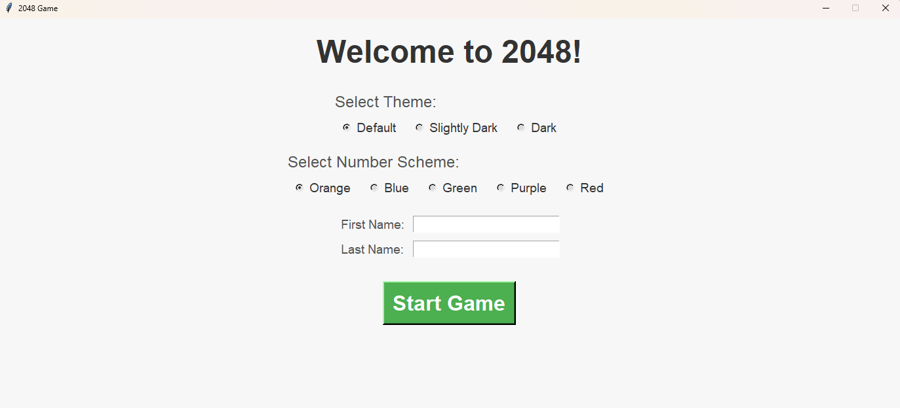
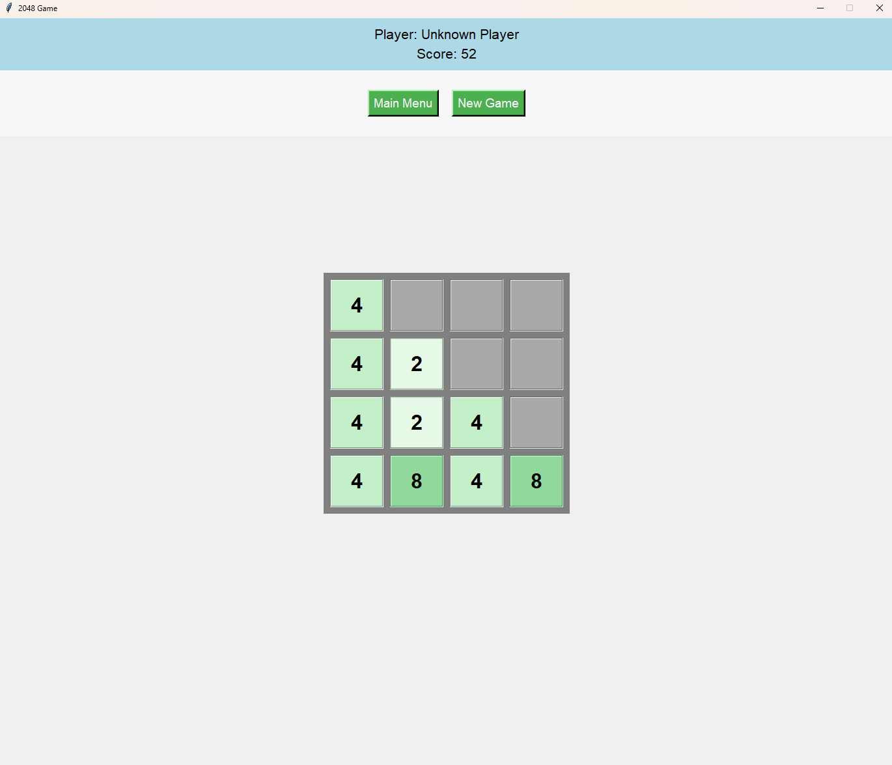

# Game2048

## Group Composition AVA (Ali-Vanessa-Andrew)

### Developers:
- [**Ali Rahmani**](https://myweb.uiowa.edu/alirahmani/)
- **V**anessa Banks
- **A**ndrew Putt
  

## What is the Game?

The game **2048** is a fun and addictive puzzle game. Players move numbered tiles on a grid to combine them and create larger numbers. The game begins with two tiles, showing either 2 or 4.

Players use arrow keys to slide all tiles in one direction during their turn. If two tiles with the same number touch, they merge into one tile with their total value. The main goal is to create a tile with the number **2048**, which gives the game its name.

The game ends when no moves are left, either because the grid is full or no tiles can combine anymore.

## What Does the User Have to Do?

The user (player) in **2048** moves the tiles on the grid by sliding them in one of four directions: up, down, left, or right. The objective is to combine tiles with the same number to create larger numbers, aiming to reach the target tile (2048). Below are the steps:

1. **Slide Tiles**: Use the arrow keys to move all tiles in the selected direction. Every move causes all tiles to shift as far as possible in that direction.
2. **Combine Tiles**: When two tiles with the same number touch, they merge into a single tile with their combined value (e.g., 2 + 2 = 4, 4 + 4 = 8).
3. **Strategize**: Plan moves carefully to avoid filling up the grid too quickly. Each move spawns a new tile (usually 2 or 4), so space management is key.
4. **Aim for 2048**: Combine tiles to create one with the number 2048. Players can also continue playing beyond this goal.
5. **Avoid Game Over**: Prevent the grid from filling completely with no possible moves left. If no moves are available, the game ends.

The key is to think strategically, plan moves, and anticipate how the tiles will combine to keep progressing toward the goal!

## How Does the User Win or Lose?

- **Win**: The player wins the game upon successfully creating a tile with the number **2048**.
- **Lose**: The player loses if the grid becomes completely filled and no valid moves are available.

## Game View

### Start Page

### Game in Progress

